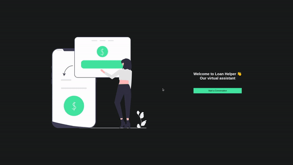

# Chat Bot

The application consists of a bot that helps you make your first loan, clearing your possible doubts.

[Link for the site](https://chat-bot-lexart-labs.vercel.app/)
(Note: The site is expected on a free service, causing in some cases to take about 30-40 seconds to respond)



## Tecnologias Usadas

Tests:
> Jest

DevOps:
> Docker, Docker-Compose,GitHub Actions, Render, Vercel

DataBase:
> MongoDb

### Back-End:

> NodeJS, Nest.Js, Mongoose, Typescript

### Front-End:

> React, Typescript, Context

## Run application

The frontend and backend folders have readmes to run each service individually

<details>
  <summary><b>Run app with docker-compose 🐳</b></summary>

  ***⚠️ To ensure proper functionality, it's necessary to have Docker and Docker-Compose installed in versions 24.0.5 and 1.29 or higher, respectively. ⚠️***

  1. Clone the project

  2. Navigate to the project directory

  3. In root directory, bring up the containers:


  ```bash
$ docker-compose -f docker-compose.dev.yml up --build -d
  ```

  5. Once the container processes have finished, access the application using the following address:


  ```bash
http://localhost:3000
  ```

  6. To bring down the containers:

  ```bash
$ docker-compose -f docker-compose.dev.yml down --rmi all --volumes --remove-orphans
  ```

</details>

<br />
