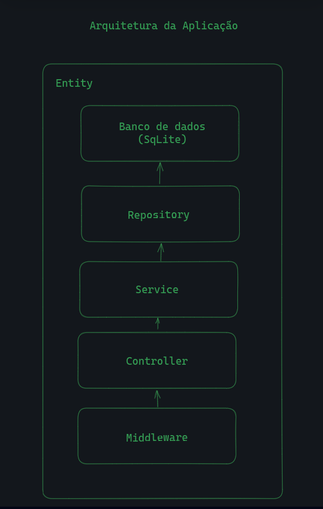

# Chat Bot Backend



## Run application

<details>
  <summary><b>Run app with docker-compose 🐳</b></summary>

  ***⚠️ To ensure proper functionality, it's necessary to have Docker and Docker-Compose installed in versions 24.0.5 and 1.29 or higher, respectively. ⚠️***

  1. Clone the project

  2. Navigate to the project directory

  3. In the root directory of the `backend`, bring up the containers:

  ```bash
$ docker-compose -f docker-compose.dev.yml up --build -d
  ```

  5. Once the container processes have finished, access the application using the following address:


  ```bash
http://localhost:3001
  ```

  6. To bring down the containers:

  ```bash
$ docker-compose -f docker-compose.dev.yml down --rmi all --volumes --remove-orphans
  ```

</details>

<br />

<details>
  <summary><b>Run app with node</b></summary>

  1. Clone the project

  2. Navigate to the project directory

  3. In the root directory of the `backend`, install dependencies:

  ```bash
$ npm install
  ```

  4. In the root directory of the backend there is a file `.env.example` in it has the necessary env keys to configure the project, adapt it according to your configs


  5. Make sure your mongodb is working:

  6. To start the application run this commnad:

  ```bash
$ npm run start:dev
  ```

  7. Once the container processes have finished, access the application using the following address:

  ```bash
http://localhost:3001
  ```

</details>
