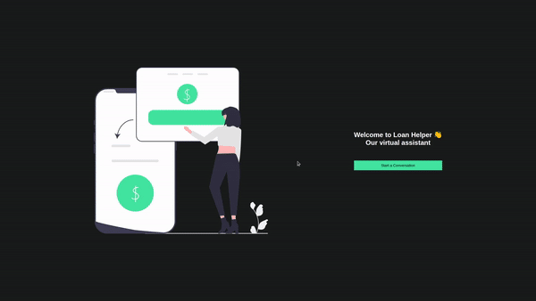

# Chat Bot FrontEnd



## Run application

<details>
  <summary><b>Run app with docker 🐳</b></summary>

  ***⚠️ To ensure proper functionality, it's necessary to have Docker installed in versions 24.0.5 or higher. ⚠️***

  1. Clone the project

  2. Navigate to the project directory

  3. In the root directory of the `frontend`, bring up the container:

  ```bash
$ docker build . -t chat-bot-web -f Dockerfile.dev
  ```

  4. Still root directory of the frontend go up go up the container

  ```bash
$ docker run --name chat-bot-web -p 3000:3000 chat-bot-web
  ```

  5. When the container process is finished access the application using the following address

  ```bash
http://localhost:3000
  ```

</details>

<br />

<details>
  <summary><b>Run app with node</b></summary>

***⚠️ To ensure proper functioning, you must have node installed in version 18 or higher⚠️***

  1. Clone the project

  2. Navigate to the project directory

  3. In the root directory of the `frontend`, install dependencies:

  ```bash
$ npm install
  ```

  4. By default the backend connection url is `http://localhost:3001` if you want to change it just run the following command replacing `<your_url>` by your url, in the frontend root

  ```bash
$ echo "REACT_APP_PUBLIC_API=<your_url>" > .env 
  ```

  5. To start the application run this commnad:

  ```bash
$ npm run start
  ```

  6. Once the container processes have finished, access the application using the following address:

  ```bash
http://localhost:3000
  ```

</details>
